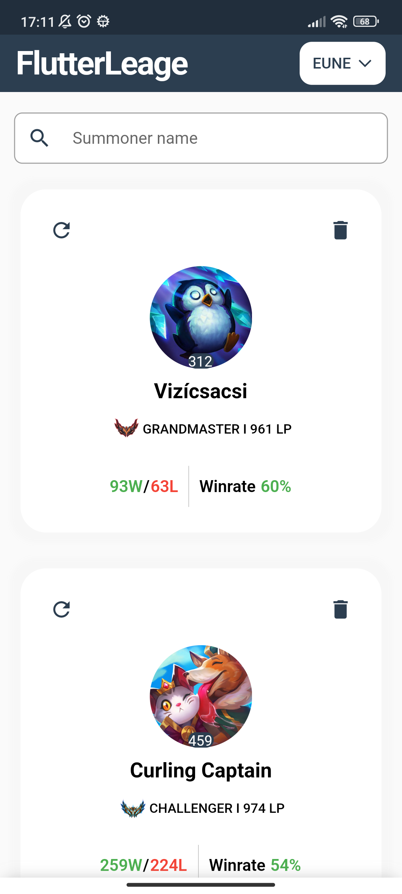
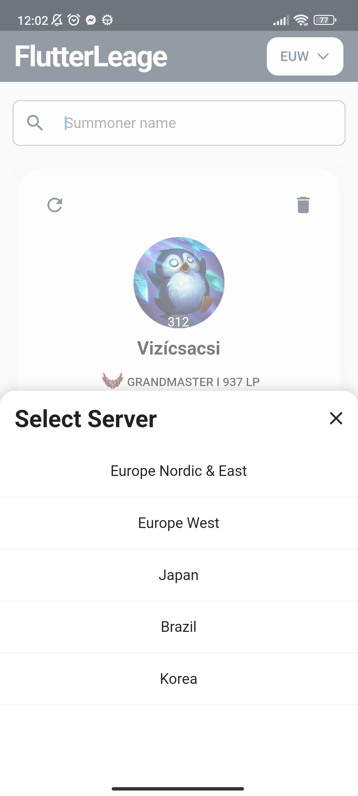
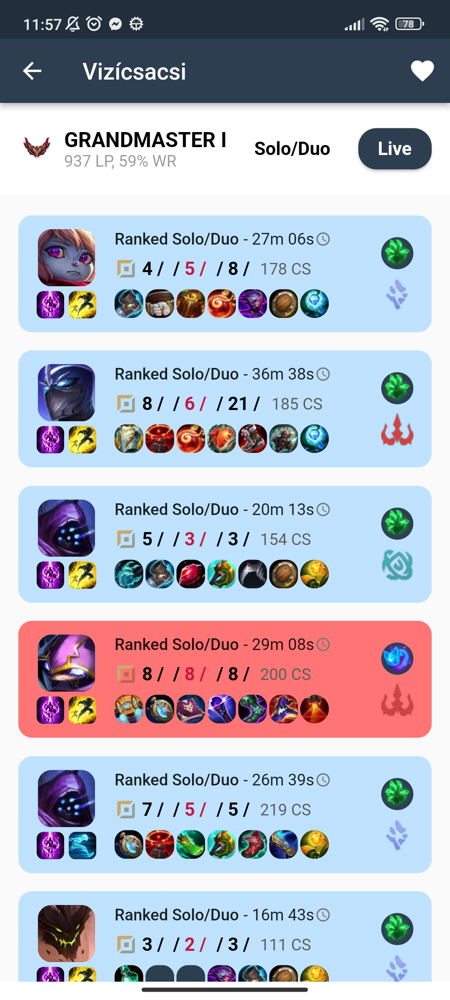
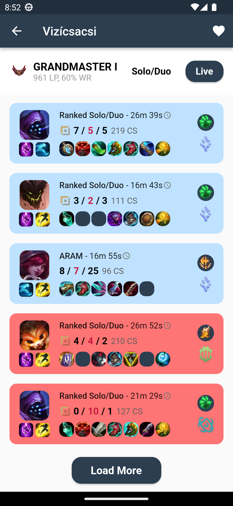
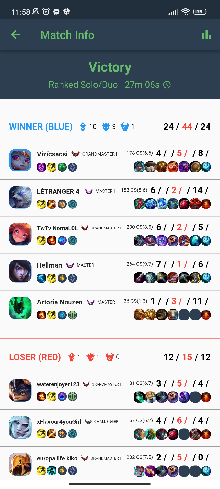
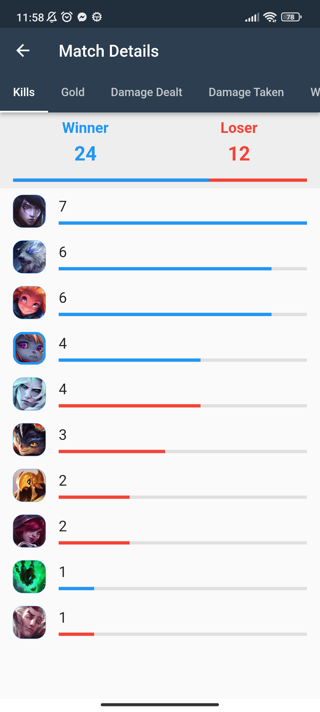
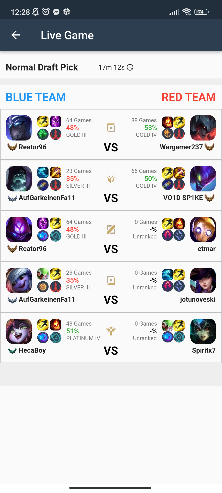

# Flutter League
Flutter League is a companion app for League of Legends players that allows them to search for summoners, view their stats and match history, and check currently ongoing games.

## Pages
The app consists of the following pages:

### Home Page
The Home page is the first screen users see when they open the app. It displays information about the summoners that the user has saved as favorites. Users can select a League of Legends server and search for summoners.

  
   

### Match History Page
The Match History Page displays a summoner's match history. It shows the summoner's rank, match history data, and provides the user with the option to load more matches.

  
  

### Match Info Page
The Match Info page displays the details of a specific match, including the result, player stats, and team compositions.

### Match Details Page
The Match Details page displays information about kills, gold, damage dealt, damage taken, wards, and CS in a TabView format.

### Live Game Page
The Live Game page displays information about a currently ongoing League of Legends game, including player information and match details. It uses the DartLeagueRoleIdentify algorithm, available on GitHub at https://github.com/csuka1219/DartLeagueRoleIdentify, to identify the role for each player in the game.

## Getting Started
To run the app, follow these steps:

1. Clone the repository to your local machine.
2. Open the project in your preferred IDE (e.g., Android Studio, VS Code).
3. Create a Riot API key and add it to the lib/utils/config.dart file. You can get a key by following the instructions here: https://developer.riotgames.com/docs/portal.
4. Run the app in the emulator or on a physical device.

## Dependencies
The app uses the following dependencies:

- provider: A state management library that allows easy sharing of data between widgets.
- flutter_svg: A library for rendering SVG images in Flutter.
- http: A library for making HTTP requests to an API.
- intl: A library for formatting dates and numbers.
- tuple: A library for creating and manipulating tuples.
- shared_preferences: A library for persisting key-value data on the device.

## Contributing
There are still some features and improvements that could be made to this app. If you would like to contribute, please feel free to fork the repository and create a pull request. Here are some things that could be improved:

- Add a message box to display the result when searching for a summoner that does not exist.
- Add a message box to display the result when clicking on the "Live Game" button if there is no currently ongoing game.
- Remove the display of players' roles in ARAM mode in the "Live Game" page.
- There are some unsupported game modes such as "One For All".
- You can implement any new features you desire.

## License
This project is licensed under the MIT License. Feel free to use it for your own purposes.

